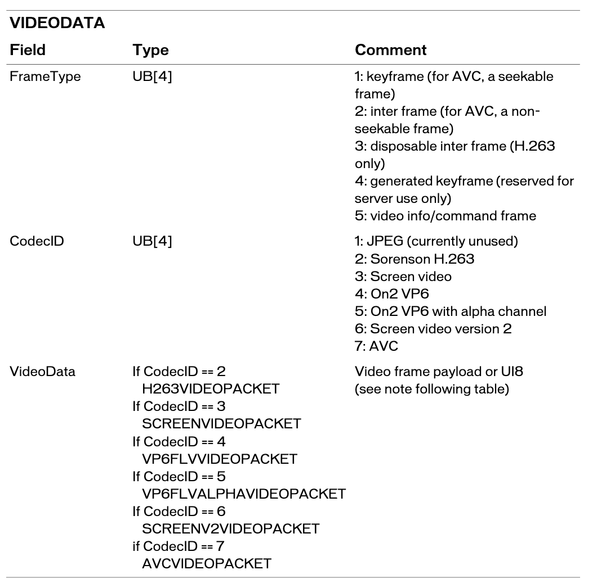
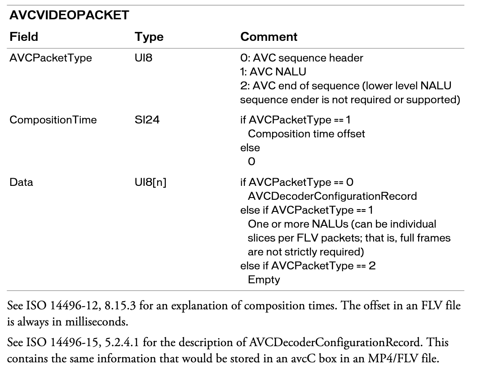
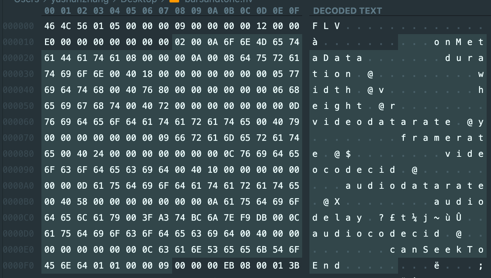

# flv 文件格式

每个tag类型组成一个流. 一个flv文件可以有一个或0个音频流, 以及一个视频流同步组合在一起. 一个flv文件不能定义同类型的多个独立的流.

flv使用大端字节序

## flv header (9字节)

|field|type|comment|
|:----:|:----:|:----:|
|signature|UI8|'F'(0x46)|
|signature|UI8|'L'(0x4c)|
|signature|UI8|'V'(0x56)|
|version|UI8|文件版本(比如, 0x01是版本1)|
|TypeFlagsReserved|UB\[5\]|保留, 必须为0|
|TypeFlagsAudio|UB\[1\]|音频tag是否存在|
|TypeFlagsReserved|UB\[1\]|保留, 必须为0|
|TypeFlagsVideo|UB\[1\]|视频tag是否存在|
|DataOffset|UI32|从文件起始处到文件body处的字节数(头部的长度, flv version 1中是9, 为将来拓展头部留下空间)|

## flv file body
在flv header之后, flv 文件的剩余部分由交替的反向指针和tag组成, 形如下表

|field|type|comment|
|:----:|:----:|:----:|
|PreviousTagSize0|UI32|总是0|
|Tag1|FLVTAG|第一个tag|
|PreviousTagSize1|UI32|上一个tag的大小, 包括其头部. 对于flv version 1 , 它的值是11 + 上个tag的数据大小|
|Tag2|FLVTAG|第二个tag|
|...|...|...|
|PreviousTagSizeN-1|UI32|倒数第二个tag的大小|
|TagN|FLVTAG|最后一个tag|
|PreviousTagSizeN|UI32|最后一个tag|

## flv tags

|field|type|comment|
|:----:|:----:|:----:|
|TagType|UI8|tag的类型 8: 音频; 9: 视频; 18: 脚本数据; 其他: 保留|
|DataSize|UI24|data字段中的数据长度|
|Timestamp|UI24|这个tag中数据使用的时间(毫秒单位), 该值相对于第一个tag,第一个tag的该值为0|
|TimestampExtended|UI8|扩展时间戳字段为SI32的值, 这个字段代表高8比特|
|steamID|UI24|总是0|
|Data|AUDIODATA\|\|VIDEODATA\|\|SCRIPTDATAOBJECT |tag体|

在播放中, flv tags的时间序列只取决于flv 时间戳, 任何放在payload中的时序机制都被忽略

## audio tags

AUDIODATA

|field|type|comment|
|:----:|:----:|:----:|
|SoundFormat|UB\[4\] 0 = linear PCM, 平台字节序 1 = ADPCM 2 = MP3 3 = linear PCM, 小端字节序 4 = Nellymoser 16-kHz mono 5 = Nellymoser 8-kHz mono 6 = Nellymoser 7 = G.711 A-law logarithmic PCM 8 = G.711 mu-law logarithmic PCM 9 = reserved  10 = AAC 11 = Speex 14 = MP3 8-Khz 15 = Device-specific sound|声音数据的格式 格式7,8,14,15为内部使用保留...?|
|SoundRate|UB\[2\] 0 = 5.5-kHz 1 = 11-kHz 2 = 22-kHz 3 = 44-kHz|采样率, 对于AAC, 总是3|
|SoundSize|UB\[1\] 0 = snd8Bit 1 = snd16Bit|每个采样的大小. 这个字段只对没有压缩的格式适用. 压缩的总是解码为16 bits |
|SoundType|UB\[1\] 0 = sndMono 1 = sndStereo|对Nellymoser永远是0,  对AAC永远是1|
|SoundData|UI8\[声音数据的大小\]|if SoundFormat == 10 AACAUDIODATA  else sound data varies by format |

    mono : 单声道
    stereo : 多声道

> format 3 ,linear PCM 存储 raw PCM 采样.
如果数据是8-bit的,采样是无符号的. 如果数据是16-bit的, 采样存储为小段的有符号数字.
如果数据是stereo, 左右采样交替存储: 左 - 右 - 左 - 右 ..

> format 0 PCM 和format3 PCM 相似. 除了format 0 存储16-bit采样时使用平台字节序(文件被创造的平台), 因此, 不太推荐使用format 0

> AAC 的SoundRate 和 SoundType必须设为3 和 44kHz,但实际使用的是编码在AAC比特流里的信息 

### AACAUDIODATA

|field|type|comment|
|:----:|:----:|:----:|
|AACPacketType|UI8|0: ACC sequence header 1: AAC raw|
|Data|UI8\[n\]|if AACPacketType == 0 AudioSpecificConfig  else if AACPacketType = 1 Raw AAC frame data|

## video tags

Video tags9VIDEODATAIf FrameType = 5, instead of a video payload, the message stream contains a UI8 with the following meaning: 
■0 = Start of client-side seeking video frame sequence
■1 = End of client-side seeking video frame sequence

### AVCVIDEOPACKET

#### AVCDecoderConfigurationRecord

AVCDecoderConfigurationRecord 即 AVC SequenceHeader
对于h.264/avc编码格式的flv文件, onMetaData是第一个tag, 之后的第二个tag就是AVCDecoderConfigurationRecord, 也是第一个videoTag, 在flv文件中一般也只出现一次.
其中包含解码相关的重要pps和sps信息. 在给AVC解码器送数据流之前一定要把sps和pps信息送到, 且当解码器快进快退, 跳转的时候也要重新发送sps和pps信息

|field|type|comment|
|:----:|:----:|:----:|
|configurationVersion|UI8|版本号, 1|
|AVCProfileIndication|UI8|SPS[1]|
|profile_compatibility|UI8|SPS[2]|
|AVCLevelIndication|UI8|SPS[3]|
|---|UB[6]|保留 111111|
|lengthSizeMinusOne|UB[2]|NALUnitLength - 1, 一般为3|
|---|UB[3]|保留111|
|numOfSequenceParameterSets|UB[5]||
|sps|spsSet[numOfSequenceParameterSets]|sps个数, 一般为1|
|numOfPictureParameterSets|UB[8]| pps个数, 一般为1|
|pps|ppsSet[numOfSequenceParameterSets]||

##### spsSet

|field|type|comment|
|:----:|:----:|:----:|
|sequenceParamterSetLength|UI16||
|sequenceParameterSetNALUnit|UI8[sequenceParameterSetLength]||

##### ppsSet

|field|type|comment|
|:----:|:----:|:----:|
|pictureParameterSetLength|UI16||
|pictureParamterSetNALUnit|UI8[pictureParameterSetLengths]||

#### NALU结构

nalu是H264中的数据单元
nalu = start code + nalu header + nalu payload(rbsp)
- start code : 1字节 000001B 或 00000001B
- nalu header : 1字节 
    - forbidden_zero_bit(1 bit) : 禁止位, 初始为0, 当网络发现nal单元有比特错误时设为1
    - nal_ref_idc(2 bit) : nal重要性指示, 值越大, 该nal越重要, 解码器处理不过来时, 可以丢掉重要性为0的nalu
    - nal_unit_type(5 bit) : nalu 类型
        - 5 : idr
        - 7 : sps
        - 8 : pps
        - ...

#### SODB 和 RBSP

sodb是最原始的编码数据rbsp, 长度不一定是8的倍数, 需要对齐, 在sodb的后面添加结尾比特1 + 0 * n, 以对齐.
## data tags

### SCRIPTDATA

|field|type|comment|
|:----:|:----:|:----:|
|objects| SCIPTDATAOBJECT[]|任意数量的SCRIPTDATAOBJECT结构|
|end|UI24|总是9, SCRIPTDATAOBJECTEND|

### SCRIPTDATAOBJECT

|field|type|comment|
|:----:|:----:|:----:|
|ObjectName|SCRIPTDATASTRING|对象的名字|
|ObjectData|SCRIPTDATAVALUE|对象的数据|

### SCRIPTDATAOBJECTEND

|field|type|comment|
|:----:|:----:|:----:|
|ObjectEndMarker2|UI24|9|

### SCRIPTDATASTRING

|field|type|comment|
|:----:|:----:|:----:|
|StringLength|UI16|字符串长度(字节数)|
|StringData|STRING|字符串数据|

### SCRIPTDATALONGSTRING

|field|type|comment|
|:----:|:----:|:----:|
|StringLength|UI32|字符串长度(字节数)|
|StringData|STRING|字符串数据|

### SCRIPTDATAVALUE

|field|type|comment|
|:----:|:----:|:----:|
|Type|UI8|0 = 数字  1 = 布尔 2 = 字符串 3 = 对象 4 = movieclip 5 = null 6 = undefined 7 = reference type 8 = ecma array type 10 = strict array type 11 = date type 12 = long string type|
|ECMAArrayLength|if type = 8, UI32|ecma数组字段数|
|ScriptDataValue|if type == 0 Double if type == 1 UI8 if type == 2 SCRIPTDATASTRING if type == 3 SCRIPTDATAOBJECT\[n\] if type == 4 SCRIPTDATASTRING if type == 7 UI16 if type == 8 SCRIPTDATAVARIABLE[] if type == 10 SCRIPTDATAVARIABLE\[n\] if type == 11 SCRIPTDATADATE 12 SCRIPTDATALONGSTRING |数据值|
|ScriptDataValueTerminator|if type == 3 SCRIPTDATAOBJECTEND if type == 8 SCRIPTDATAVARIABLEEND|结束符|

### SCRIPTDATAVARIABLE

|field|type|comment|
|:----:|:----:|:----:|
|VariableName|SCRIPTDATASTRING|变量名称|
|VariableData|SCRIPTDATAVALUE|值|

### onMetaData 

    onMetaData中包含了音视频相关的元数据，封装在Script Data Tag中，它包含了两个SCRIPTDATAVALUE。
    第一个SCRIPTDATAVALUE：

    第1个字节：0x02，表示字符串类型
    第2-3个字节：UI16类型，值为0x000A，表示字符串的长度为10（onMetaData的长度）；
    第4-13个字节：字符串onMetaData对应的16进制数字（0x6F 0x6E 0x4D 0x65 0x74 0x61 0x44 0x61 0x74 0x61）；

    第二个SCRIPTDATAVALUE：

    第1个字节：0x08，表示数组类型；
    第2-5个字节：UI32类型，表示数组的长度，onMetaData中具体包含哪些属性是不固定的。
    第6个及之后: SCRIPTDATAVARIABLE * 数组长度

■duration: a DOUBLE indicating the total duration of the file in seconds

■width: a DOUBLE indicating the width of the video in pixels

■height: a DOUBLE indicating the height of the video in pixels

■videodatarate: a DOUBLE indicating the video bit rate in kilobits per second

■framerate: a DOUBLE indicating the number of frames per second

■videocodecid: a DOUBLE indicating the video codec ID used in the file (see “Video tags” on page 8 for available CodecID values)

■audiosamplerate: a DOUBLE indicating the frequency at which the audio stream is replayed

■audiosamplesize: a DOUBLE indicating the resolution of a single audio sample

■stereo: a BOOL indicating whether the data is stereo

■audiocodecid: a DOUBLE indicating the audio codec ID used in the file (see “Audio tags” on page 6 for available SoundFormat values)

■filesize: a DOUBLE indicating the total size of the file in bytes

**onmetadata 示例**

