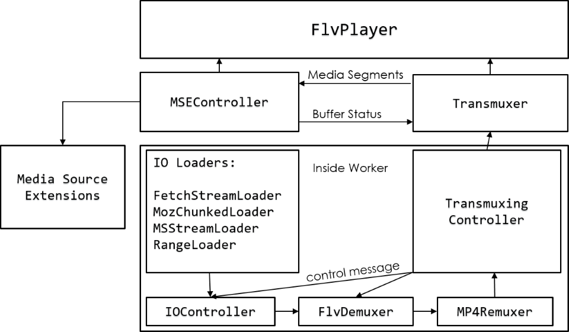

# 使用方式

```html
<script src='flv.min.js'></script>
<video id='videoElement'></video>
<script>
    if(flvjs.isSupported()) {
        var videoElement = document.getElementById('videoElement);
        
        // 给element上的一些属性赋值可以改变flvPlayer的一些行为, 属性如
        //videoElement.duration
        //videoElemnt.hasAudio
        // hasVideo
        var flvPlayer = flvjs.createPlayer({
            type: 'flv',
            url: 'http://example.com/flv/video.flv'
            //isLive: boolean 直播
        }, {
            //deferLoadAfterSourceOpen: boolean 延迟加载数据
            // autoCleanupSourceBuffer: boolean
            // enableWorker : boolean 浏览器条件允许时使用worker进行codec部分的处理
            // stashInitialSize: number io 初始化buffer
            // customSeekHandler: function io seek处理句柄
        });
        flvPlayer.attachMediaElement(videoElement);
        flvPlayer.load();
        flvPlayer.play();
    }
</script>
```

# 体系结构


