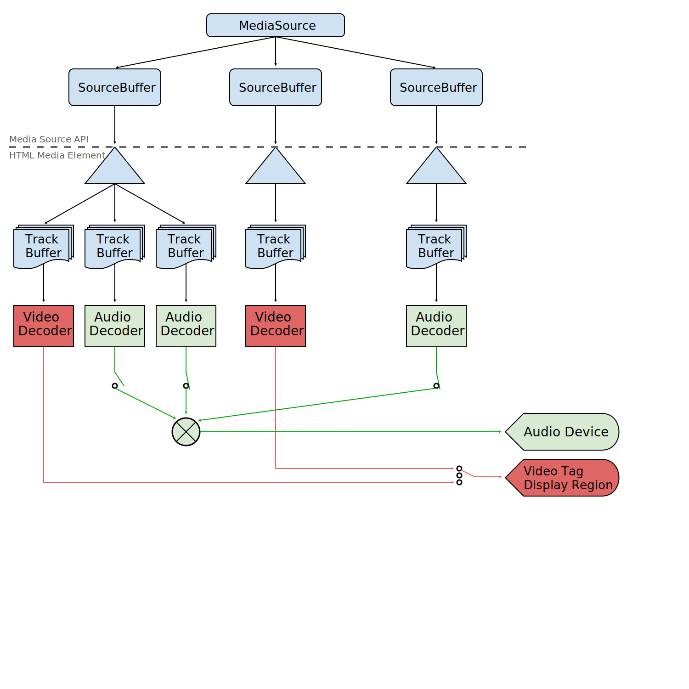

# 介绍

这个规范允许js动态构建video和audio的媒体流. 它定义了一个*MediaSource*对象, 该对象可作为HTMLMediaElement的媒体数据源. MediaSource 对象有一个或多个*SourceBuffer*对象. 应用给SourceBuffer添加数据段,也可以基于系统性能或其他因素改变添加数据的quality. 来自SourceBuffer的数据被管理为正在解码播放的音频, 视频, 文本数据的track buffers

## 接口

### MediaSource

代表了将由HTMLMediaElement对象播放的媒体资源

...

### SourceBuffer

代表了一个经由MediaSource对象被传入HTMLMediaElement的媒体块

...

### SourceBufferList 

列出多个SourceBuffer对象的简单的容器列表

...

### VideoPlaybackQuality

包含了有关正在被播放的视频的质量信息, 由 HTMLVideoElement.getVideoPlaybackQuality() 方法返回

...

### TrackDefault 

为在媒体块的初始化阶段没有包含类型, 标签和语言信息的轨道提供一个包含这些信息的SourceBuffer.

...

### TrackDefaultList

列出多个TrackDefault对象的简单的容器列表

