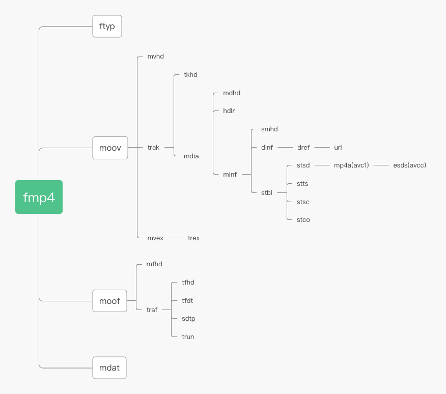

# ISO BMFF Byte Stream Format

## 摘要

该标准定义了一个用做 Media Source Extensions byte stream 的, 基于ISO Base Media File Format 的标准.

## 介绍

该规范定义了用于向codec 发送的MIME类型参数, 提供了mse标准需要的byte stream formats section必要初始化段, 媒体段和随机访问段的格式定义.

## mime type parameters

## initialization segments

在这个规范里初始化段是一个file type box(ftyp)接上一个movie header box(moov)

合法的顶级box比如pdin, free sidx允许出现在moov box之前. 但这些段要被用户代理接收并忽略, 不作为该规范初始化段的一部分.

## media segments

在本规范中媒体段被定义为一个可选的segment type box(styp)接上一个 movie fragment box(moof)接上一个或多个media data boxes(mdat). 
如果styp不存在, 段必须符合初始化段的ftyp中列出来的brand

除了ftyp, moov, styp, moof, mdat的合法的顶级boxes,允许出现在初始化段的结尾, 或 媒体段, 或在一个新媒体段的前面, 这些boxes同样被接收并忽略, 并不被认为是该规范的一部分.

## random access points

该规范中的random access points 对应于 iso/iec_14496-12中定义的stream access point 类型1或2


## fmp4 的结构



```
|--------|
|  ftyp  |
|________|
|  moov  |
|________|
|  styp  | (optional)
|________|
|  moof  |
|________|
|  mdat  | * N
|________|
```


# mp4 boxes

## MOOV 
movie atom 定义了一部电影的数据信息, 类型为moov, 是一个容器atom, 至少包含三种atom的一种: movie header atom(mvhd), compressed movie atom(cmov), reference movie atom(rmra)
可能包含的box: clipping atom(clip), track atom (trak), color table atom(ctab), user data atom(udta)

|field|type|comment|
|:----:|:----:|:----:|
|尺寸|UI32|这个box的字节数|
|类型|UI32|'moov'|

## MVHD
movie header atom 定义了整个movie的特性, 如time scale 和 duration. 它的atom类型是'mvhd'

### 结构:

|字段|大小(字节)|说明|
|:----:|:----:|:----:|
|atom size|4|mvhd的尺寸|
|type|4|'mvhd'|
|version|1||
|flags|3||
|creation time|4||
|modification time|4||
|time scale|4| 代表文件的时间单位 1/timescale 秒|
|duration|4|时长: duration * timescale 秒|
|preferred rate|4|0x00010000 时代表原始速率, 高16位整数部分, 低16位小数部分|
|preferred volume|2|0x0100 代表满音量1,格式同上 |
|reserved|10||
|matrix structure|36||
|preview time|4||
|preview duration|4||
|poster time|4||
|selection time|4||
|selection duration|4||
|current time|4||
|next track id|4||

## TRAK
一个track atom 定义了movie中的一个track, 一部movie可以包含一个或多个tracks, 它们之间互相独立, 各自有各自的时间和空间信息, 每个track atom都有与之相关的media atom.

track主要用处:
- 包含媒体数据引用和描述(media tracks)
- 包含modifier tracks(tweens等)
- 对于流媒体协议的打包信息(hint tracks). hint tracks 可以引用或者复制对应的媒体sample data.

trak atom 必须有一个track header atom(tkhd), 一个media atom(mdia). 其他的track clipping atom(clip), track matte atom(matt), edit atom(edts), track reference atom(tref), track load settings atom(load), track input map atom(imap), user data atom (udta)都是可选的.

### 结构

track atom 是一个容器atom , 本身没有特别的字段, 需要子atom来进一步说明有效的内容.

|字段|大小(字节)|说明|
|:----:|:----:|:----:|
|atom size|4|trak的尺寸|
|type|4|'trak'|
|sub atoms|...|...|

## TKHD

每个trak都包含了一个 track header atom, 其定义了一个track的特性, 比如时间, 空间, 音量信息等.

### 结构

|字段|大小(字节)|说明|
|:----:|:----:|:----:|
|尺寸|4|这个atom的字节数|
|类型|4|‘tkhd'|
|版本|1|这个atom的版本 1或0|
|标志|3|有效的标志:<br>0x0001 - the track is enabled<br>0x0002 - the track is used in the movie<br>0x0004 -  the track is used in the movie's preview<br>0x0008 - the track is used in the movie's poster|
|生成时间|4|movie atom的起始时间, 基准时间是1904-1-1 0:00|
|修订时间|4|movie atom的修订时间, 基准同上|
|track Id|4|唯一标志该track的非0值|
|reserved|4|0|
|duration|4|该track的duration|
|reserved|8|0|
|layer|2|空间优先度, 低的track展示在前|
|alternate group|2|一组movie tracks互相包含交替的数据|
|volume|2|1.0为正常音量|
|reserved|2|0|
|matrix|36|变换矩阵|
|宽度|4|如为video track, 图像的宽度|
|高度|4|如为video track, 图像的高度|

## EDTS

edit atoms 定义了创建movie中一个track的一部分媒体. 所有edit都在一个表里面, 包括每一部分的时间偏移量和长度. 如没有该表, 则此track会被立刻播放.

### 结构

edit atom是一个容器atom, 本身没有特别的字段

## ELST

edit list atom 用来映射movie的时间到此track media的时间, 所有信息都在一个 edit list 中, 

|字段|大小(字节)|说明|
|:----:|:----:|:----:|
|尺寸|4|这个atom的字节数|
|类型|4|‘elst'|
|版本|1|该atom的版本|
|flags|3|0|
|条目数目|4|后面接的edit list 中的条目数目|
|edit list |不定|每个条目包含三项, 如下|

edit list item

|字段|大小(字节)|说明|
|:----:|:----:|:----:|
|track durtation|4||
|media time|4||
|media rate|4||

## TREF

定义tracks间的关系

## MDIA

media atom 定义了track的媒体类型和sample数据, 如音频和视频. 它可以包含一个引用, 指明媒体数据存储在另一个文件中. 也可以包含一个sample table atoms, 指明sample description, duration, and byte offset from the data reference for each meida sample.

### 结构

media atom是一个容器atom, 必须包含一个media header atom(mdhd), 一个handler reference(hdlr), 一个媒体信息引用(minf)和用户数据atom(udta)

## MDHD

media header atom定义了媒体的特性, 例如time scale 和duration

### 结构

|字段|大小(字节)|说明|
|:----:|:----:|:----:|
|atom size|4|这个atom的字节数|
|type|4|'mdhd'|
|version|1|这个atom的版本|
|flags|3|0|
|creation time|4||
|modification time|4||
|time scale|4|the number of time units that pass per second in its time coordinate system|
|duration|4|单位为timescale|
|language|2|媒体语言码 und(undetermined) 最高字节为0, 后面三个ascii iso 639-2/t|
|pre-defined|2|0|

## HDLR

handler reference atom定义了描述此媒体数据的media handler component, 解释了媒体流的播放过程, 比如, 一个视频handler处理一个 video track.

### 结构

|字段|大小(字节)|说明|
|:----:|:----:|:----:|
|atom size|4|这个atom的字节数|
|type|4|hdlr|
|verison|1|这个atom的版本|
|flags|3|0|
|component type|4|'mhlr': media handlers <br>'dhlr':data handlers|
|component subtype|4|if component type == mhlr then 数据类型 'vide' or 'soun'<br>if comonent type == dhlr then 数据引用类型 'alis'..|
|component manufacturer|4|保留,0|
|component flags|4|保留, 0|
|component flags mask|4|保留, 0|
|component name|可变|这个component的名字, 生成meida的media handler. 可没有|

## MINF

存储了解释该track的媒体数据的handler-specific的信息。media  handler用这些信息将媒体时间映射到媒体数据，并进行处理。

### 结构

它是一个容器atom，包含其他的子atom。

## VMHD

定义颜色和图形模式信息

### 结构

|字段|大小(字节)|说明|
|:----:|:----:|:----:|
|atom size|4||
|type|4|vmhd|
|version|1||
|flags|3|总是1|
|graphics mode|2|图形模式|
|opcolor|6|3个16比特值表示红绿蓝|

## SMHD

定义了声音媒体的控制信息, 例如均衡

### 结构

|字段|大小(字节)|说明|
|:----:|:----:|:----:|
|atom size|4||
|type|4|smhd|
|version|1||
|flags|3|0|
|balance|2|音频的均衡是用来控制计算机的两个扬声器的声音混合效果, 一般是0|
|reserved|2|0|

## DINF

data information atoms 

### 结构

容器atom

## STBL

sample table atom包含转化媒体时间到实际sample的信息, 也描述了sample的信息, 如, 视频数据是否需要解压缩,解压缩算法是什么.
sample table atom 包含track中的meida sample 的所有时间和数据索引, 利用这个表, 可以定位到sample到媒体时间.
如果sample table atom 所在的track没有引用任何数据, 它不需要包含任何子atom
如果其所在的track引用了数据, 则必须包含以下子atom: sample description, sample size , sample to chunk, chunk offset, 所有子表有相同sample数

### 结构

容器atom, 包含 sample description atom, time to sample atom, sync sample atom, sample to chunk atom, sample size atom , chunk offset atom shadow sync atom.

## STSD-

sample description atom

## STTS-

time to sample atom

## STSS 

sync sample atom

## STSC

sample to chunk atom

## STSZ-

sample size atom

## STCO-

chunk offset atom

## STSH

shadow sync atom

## DREF


## MVEX

父盒子: MOOV

### 结构 

这是容器atom

## TREX

父盒子: MVEX

### 格式

|field|size|comment|
|:----:|:----:|:----:|
|size|4||
|type|4|'trex'|
|version|1|0|
|flags|3|0|
|track id|4||
|default sample description index|4|1|
|default sample duration|4|0|
|default sample size|4|0|
|default sample flags|4|0x00010001|


## MOOF

// TODO referen https://blog.csdn.net/g332065255/article/details/72365982

## MFHD

## TRAF

## TFHD

## TFDT

## TRUN

## SDTP

## MDAT

box头祖传8字节 + 纯数据